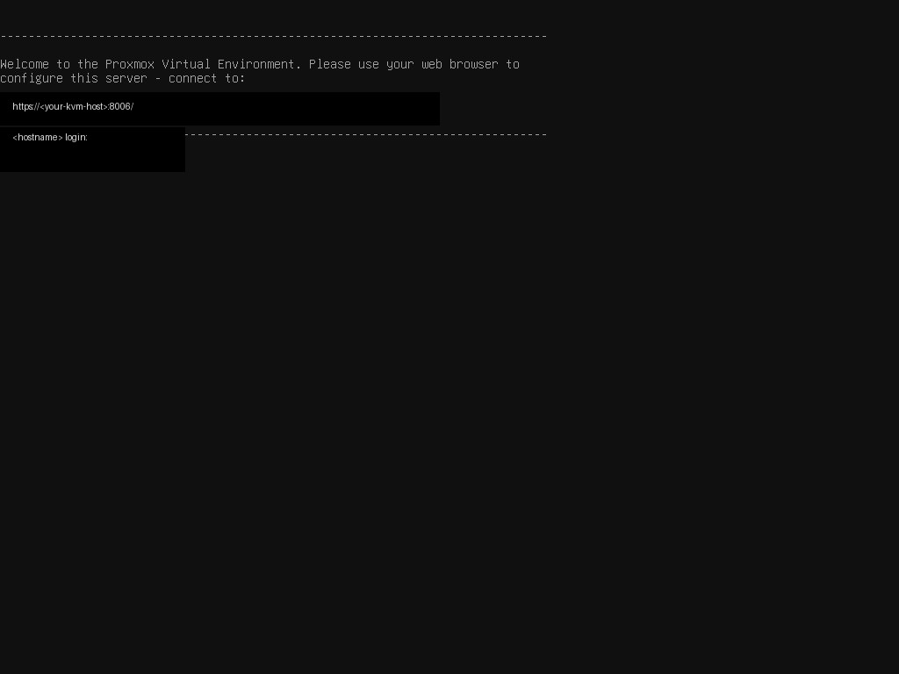

# kvmctl

A small, safety-first command-line tool for controlling KVMD-compatible KVM devices such as PiKVM and GLKVM.

Use `kvmctl` to inspect a device, capture its screen, verify a machine, and—when you explicitly authorize it—select a connected machine or run a limited command.

> **Status:** Experimental and hardware-tested. The client targets KVMD-compatible devices; switch profiles may need adjustment for your hardware.

## What you can do

- Discover device capabilities
- Capture a JPEG snapshot of the current screen
- Verify that the expected machine is on screen
- Select a named machine through a configured KVM switch
- Reset HID or re-arm the USB/OTG connection when needed
- Run explicitly allowlisted SSH commands through a configured integration
- Consume the same semantic operations from the Python API or MCP surface

## Quick start

### Install

```sh
python -m venv .venv
.venv/bin/pip install .
```

For development, install the test dependencies too:

```sh
.venv/bin/pip install -e '.[dev]'
```

### Authenticate

Keep credentials out of shell history and source control. Pass a short-lived token through the environment:

```sh
export KVMCTL_TOKEN='your-device-token'
```

Use a trusted CA bundle where possible. `--insecure` is available for devices using self-signed certificates during local setup.

### Inspect a device

```sh
kvmctl --url https://kvm.example.test --token "$KVMCTL_TOKEN" capabilities
```

The CLI prints one JSON document, making it easy to use from scripts and automation.

### Capture the current screen

```sh
kvmctl --url https://kvm.example.test --token "$KVMCTL_TOKEN" \
  snapshot --out /tmp/kvm-screen.jpg
```

### Verify a machine

```sh
kvmctl --url https://kvm.example.test --token "$KVMCTL_TOKEN" \
  verify workstation
```

### Select a machine

State-changing operations require two deliberate confirmations: `--yes` and an explicit transport.

```sh
kvmctl --url https://kvm.example.test --token "$KVMCTL_TOKEN" \
  --yes --transport kvm select workstation
```

If you omit either safety gate, `kvmctl` refuses to perform the operation.

## See it in action

This redacted capture shows the kind of console view that can be reached and verified through a KVM connection:



The published image uses placeholder host details. Real device addresses and machine names belong in your local configuration, not in documentation or issue reports.

## Configuration notes

- Device credentials and tokens are never stored in this repository.
- Read-only commands do not require `--yes`.
- Write operations are denied unless explicitly authorized.
- Machine selection requires an explicit transport so an accidental default cannot switch interfaces.
- Verification is designed to confirm the resulting screen rather than assuming that a key sequence succeeded.
- Machine profiles support configurable port limits, so additional switch layouts can be added without changing the client interface.

For device-specific setup and recovery procedures, see the [operator runbook](docs/OPERATOR_RUNBOOK.md). The runbook is intentionally separate from this user-facing introduction.

## Optional live smoke test

The live test is read-only: it discovers capabilities and requests one snapshot. It does not select ports, send HID events, or change OTG state.

```sh
KVMCTL_LIVE_URL=https://kvm.example.test \
KVMCTL_LIVE_TOKEN="$KVMCTL_TOKEN" \
PYTHONPATH=. .venv/bin/python -m pytest -q tests/test_live_hardware.py
```

## Development

```sh
.venv/bin/python -m pytest tests -q
```

Device interactions in the regular test suite use mocked transports. Live hardware tests are opt-in and skipped unless their environment variables are configured.

## License

See the repository license file for project licensing information.
